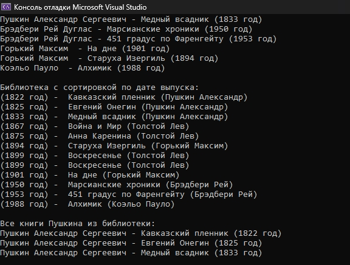

# BookLibrary
Простая программа на C#, созданная в образовательных целях.

`IBookRepository` - интерфейс репозитория книг. Служит доступом к библиотеке, с возможностью добавлять/удалить книги или получать список интересующих книг.
Имплементации:
1. `FakeBookRepository` - содержит заранее объявленый список книг.

`IBookFormatter` - интерфейс для определения формата вывода книги в консоль.
Имплементации:
1. `CommonBookFormatter` - формат вида `"{AuthorLastName} {AuthorFirstName} {AuthorMiddleName} - {BookName} ({ReleaseYear} год)"`.
2. `ReleaseYearFirstBookFormatter` - формат вида `"({ReleaseYear} год) - {BookName} - {AuthorLastName} {AuthorFirstName}"`.

`ITestUseCase` - интерфейс для тестовых кейсов.
Имплементации:
1. `PrintAllLibraryUseCase` - вывод в консоль всей библиотеки в выбранном формате.
2. `PrintBooksSortedByReleaseYearUseCase` - вывод в консоль всей библиотеки, отсортированой по возрастанию года ывпуска книги.
3. `PrintAllPushkinsBookUseCase` - вывод в консоль всех книг за авторстов А.С.Пушкина

## Пример программы (Program.cs)
```csharp
using BookLibrary.Data;
using BookLibrary.Data.TestUseCases;
using BookLibrary.Formatter;
using BookLibrary.TestUseCases;

IBookRepository bookRepository = new FakeBookRepository();

IBookFormatter commonBookFormatter = new CommonBookFormatter();
IBookFormatter releaseYearFirstFormatter = new ReleaseYearFirstBookFormatter();

Console.WriteLine("Вся библиотека:");
new PrintAllLibraryUseCase(bookRepository, commonBookFormatter).Run();
SkipLine();

Console.WriteLine("Библиотека с сортировкой по дате выпуска:");
new PrintBooksSortedByReleaseYearUseCase(bookRepository, releaseYearFirstFormatter).Run();
SkipLine();

Console.WriteLine("Все книги Пушкина из библиотеки:");
new PrintAllPushkinsBookUseCase(bookRepository, commonBookFormatter).Run();
SkipLine();

void SkipLine()
{
    Console.WriteLine();
}

```


